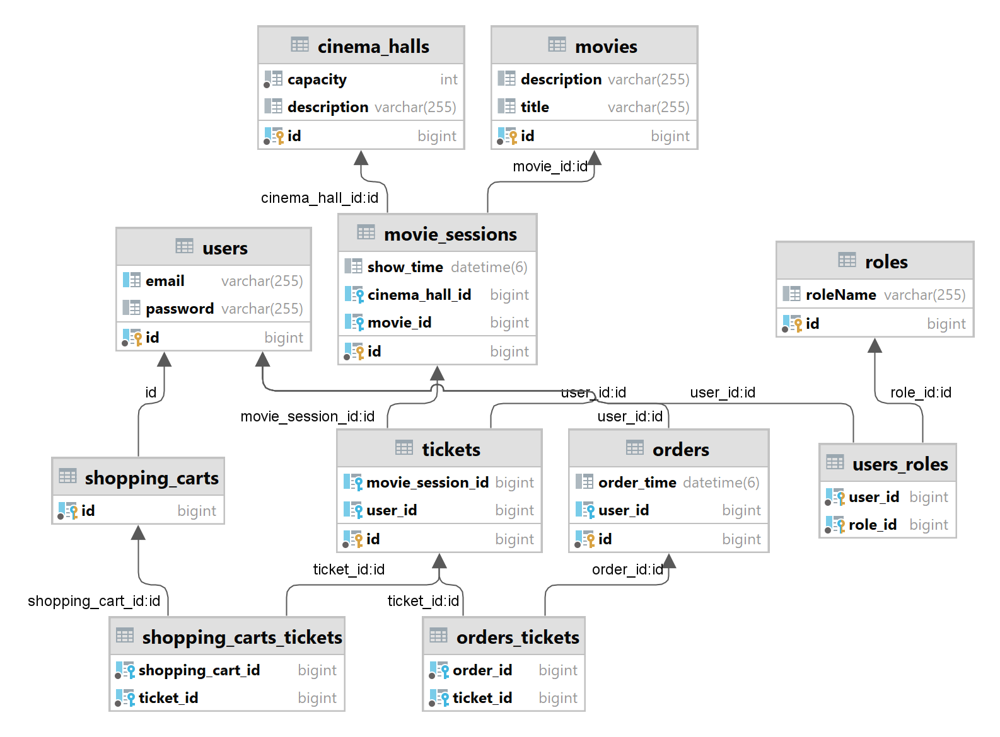

 #  Cinema-app    🎫

This is a simple web application, which was written using Hibernate and Spring frameworks. This app provides: registration, authorization,
authentication and also supports CRUD operations for working with relational database. Each new user is assigned a role 
that gives access to specific functionality of app.

#### Admin can use the following functionality:
- Create cinema hall/movie/movie session; `POST: /cinema-halls, /movies, /movie-sessions`
- Update movie session by id; `PUT: /movie-sessions{id}`
- Delete movie session by id; `DELETE: /movie-sessions{id}`
- Get information about user by email; `GET: /users/by-email`
- Get all cinema halls/movies/movie sessions; `GET: /cinema-halls, /movies, /movie-sessions/availeble`
  
#### User can use the following functionality:
- Get information about shopping carts/orders; `GET: /shopping-carts/by-user, /orders`
- Add/Remove movie session from shopping cart; `PUT: /shopping-carts/movie-sessions`
- Complete order; `POST: /orders/complete`
- Get all cinema halls/movies/movie sessions; `GET: /cinema-halls, /movies, /movie-sessions/availeble`
## Structure
Project has a three-tier architecture:
- DAO layer: works with database.
- Controllers layer: handling requests and responses.
- Service layer: include business logic.

## Database structure

## Used technologies
* Java (11);
* Apache Tomcat;
* Maven;
* MySQL;
* Hibernate;
* Spring Core;
* Spring MVC;
* Spring Security.

## Launch
1. Clone or download repository; 
2. Create schema named `cinema` in MySQL; 
3. Add your database URL, username, password and JDBC driver into corresponding fields in src/main/resources/db.properties; 
4. Configure Tomcat (v.9.0.50); 
5. You can inject custom data in src/main/java/cinema/init/DataInitializer.
6. Run the application.

